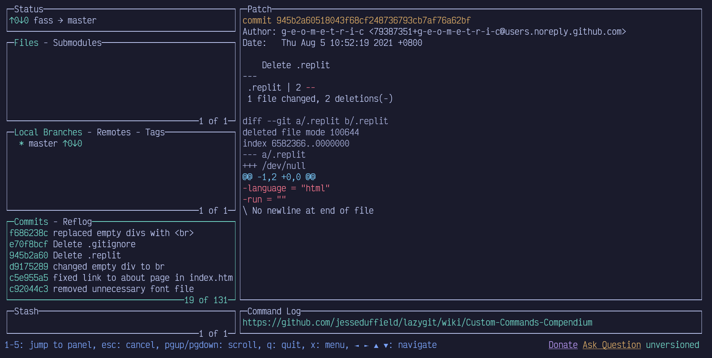
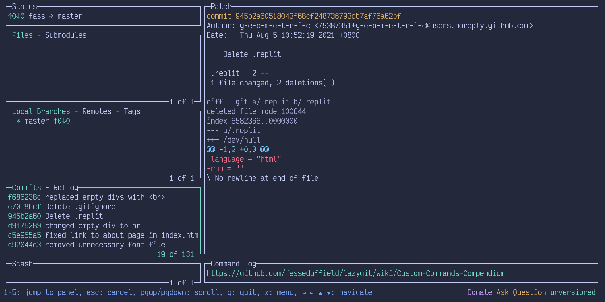
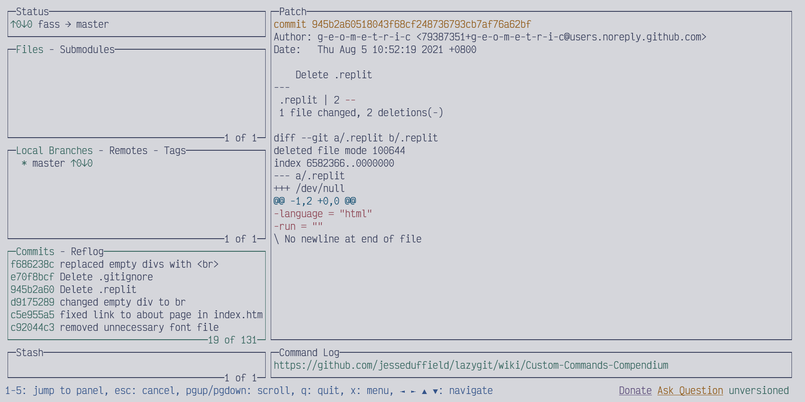

# tokyonight-windows-terminal

An unofficial port of [@enkia](https://github.com/enkia)'s amazing [Tokyo Night colorscheme](https://github.com/enkia/tokyo-night-vscode-theme) for [Windows Terminal](https://github.com/microsoft/terminal).

## How to Use

Paste the contents of the file containing your variant of choice into your Windows Terminal configuration file.

(See also: https://docs.microsoft.com/en-us/windows/terminal/customize-settings/color-schemes)

## Screenshots

Featured with [lazygit](https://github.com/jesseduffield/lazygit).

	<h3>Night</h3>
	

	<h3>Storm</h3>
	

	<h3>Light</h3>
	

